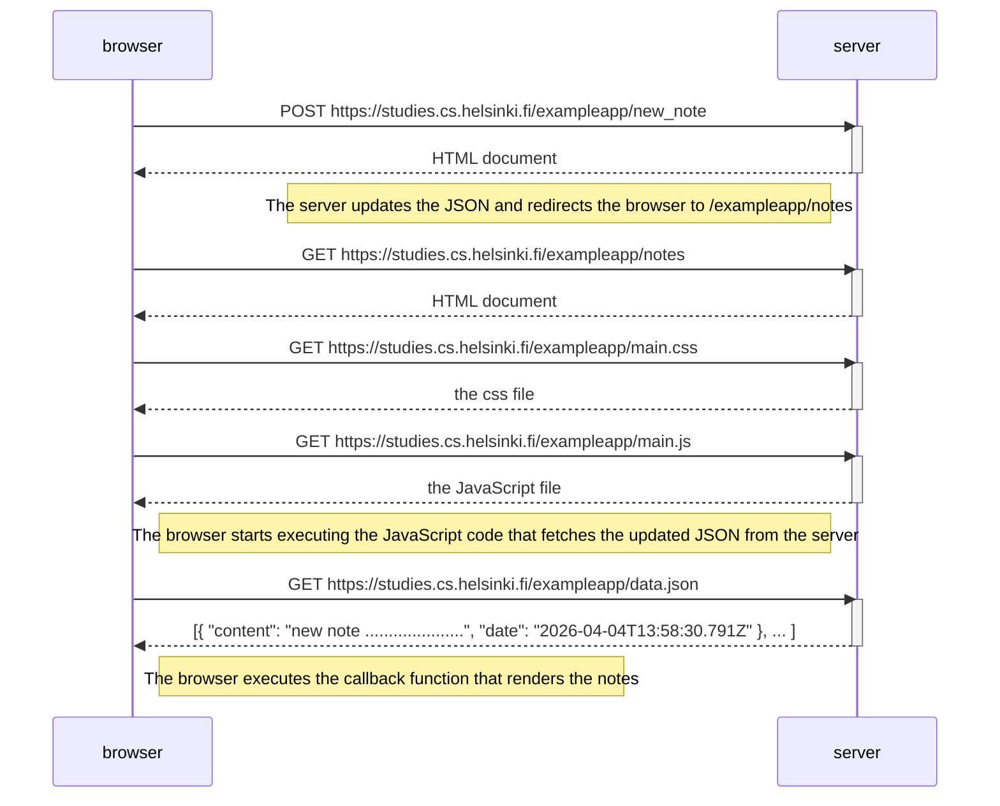

```mermaid
sequenceDiagram
  participant browser
  participant server

  browser->>server: POST https://studies.cs.helsinki.fi/exampleapp/new_note
  activate server
  server-->>browser: HTML document
  deactivate server

  Note left of server: The server updates the JSON and redirects the browser to /exampleapp/notes

  browser->>server: GET https://studies.cs.helsinki.fi/exampleapp/notes
  activate server
  server-->>browser: HTML document
  deactivate server

  browser->>server: GET https://studies.cs.helsinki.fi/exampleapp/main.css
  activate server
  server-->>browser: the css file
  deactivate server

  browser->>server: GET https://studies.cs.helsinki.fi/exampleapp/main.js
  activate server
  server-->>browser: the JavaScript file
  deactivate server

  Note right of browser: The browser starts executing the JavaScript code that fetches the updated JSON from the server

  browser->>server: GET https://studies.cs.helsinki.fi/exampleapp/data.json
  activate server
  server-->>browser: [{ "content": "new note .....................", "date": "2026-04-04T13:58:30.791Z" }, ... ]
  deactivate server

  Note right of browser: The browser executes the callback function that renders the notes
```
